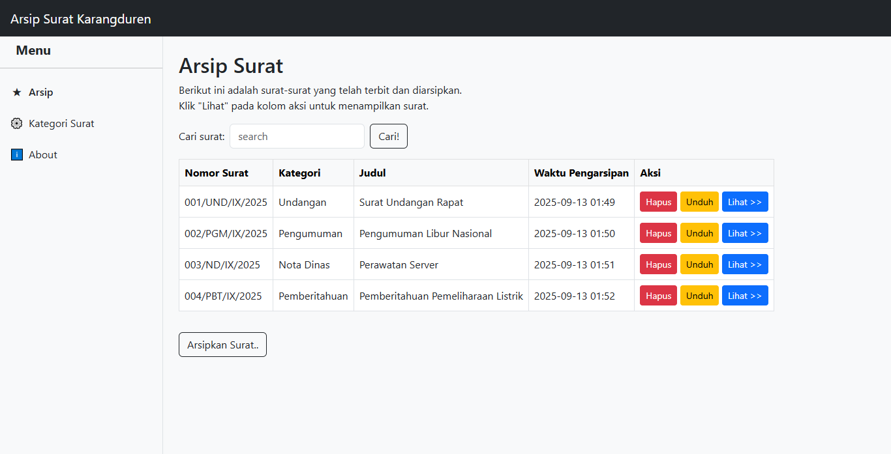
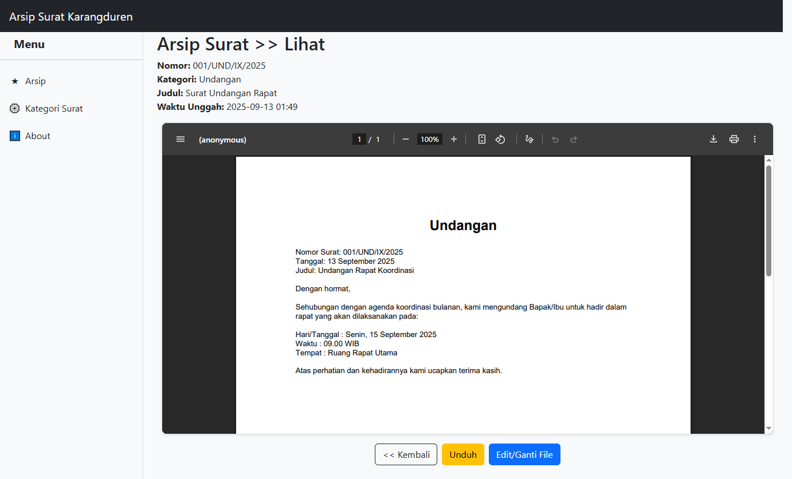
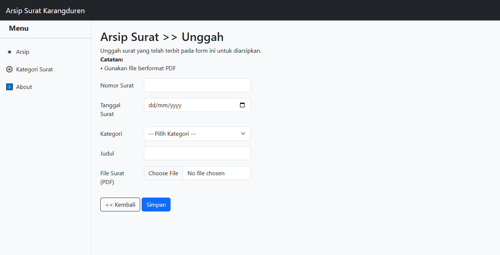
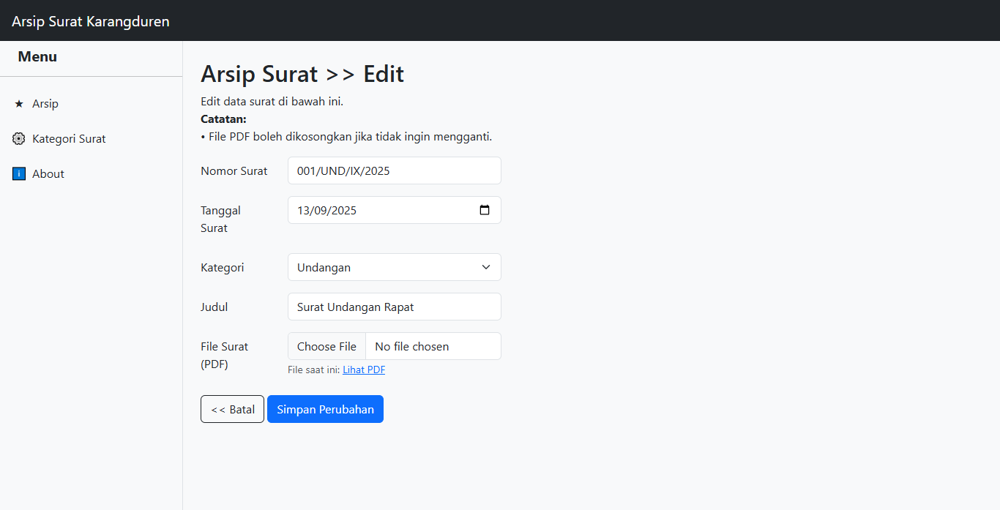
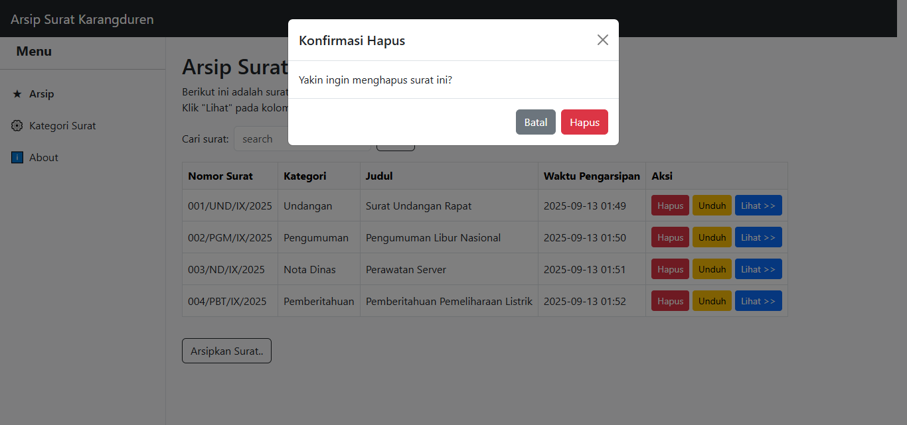
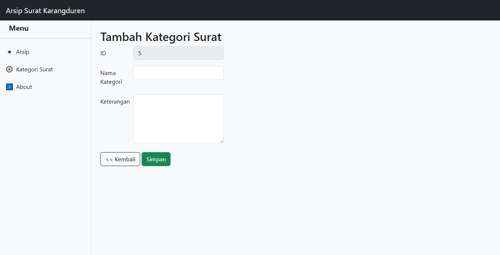
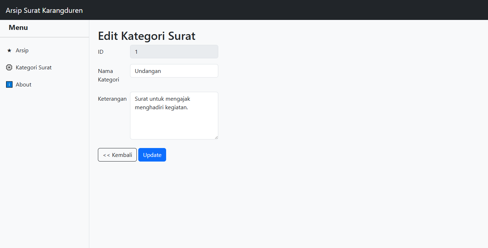
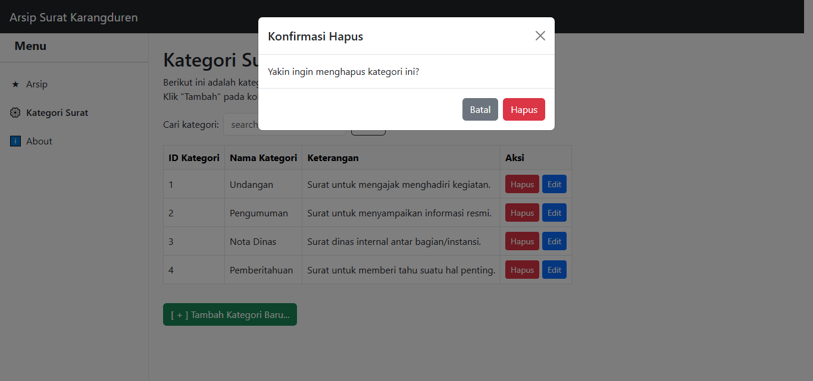
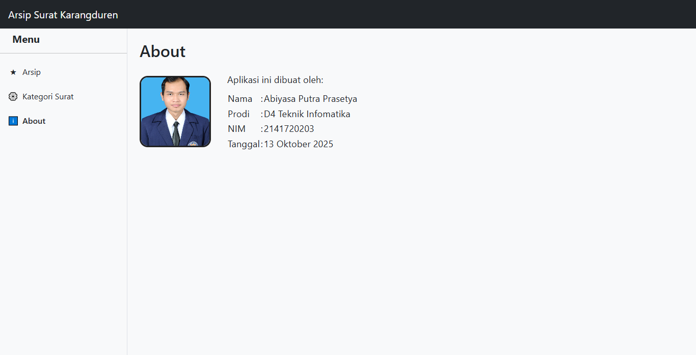

# Arsip Surat Desa

Aplikasi web Laravel untuk mengarsipkan surat-surat resmi desa, dengan fitur upload, pencarian, kategori, preview, download, dan pengelolaan kategori surat.

## Fitur Utama

## Kebutuhan Sistem
 Folder `storage/app/public/surat/` dan file PDF surat akan ikut ter-push ke repository (tidak diabaikan oleh .gitignore), sehingga file surat tetap bisa diakses setelah clone/pull.
- MySQL/MariaDB
- Node.js & npm (untuk frontend build opsional)

## Instalasi

1. **Clone repository**
	```bash
	git clone <repo-anda> arsip
	cd arsip
	```

2. **Install dependency PHP**
	```bash
	composer install
	```

3. **Copy file environment**
	```bash
	cp .env.example .env
	```

4. **Generate application key**
	```bash
	php artisan key:generate
	```

5. **Konfigurasi database**
	- Edit file `.env`, sesuaikan DB_DATABASE, DB_USERNAME, DB_PASSWORD sesuai database MySQL Anda.

6. **Jalankan migrasi database**
	```bash
	php artisan migrate
	```

7. **(Opsional) Install dependency frontend**
	```bash
	npm install && npm run build
	```

8. **Buat folder storage link**
	```bash
	php artisan storage:link
	```

9. **Letakkan foto profil untuk halaman About**
	- Simpan file foto Anda dengan nama `foto-profil.jpg` di folder `public/img/`

10. **Jalankan aplikasi**
	 ```bash
	 php artisan serve
	 ```
	 Akses aplikasi di http://localhost:8000

## Struktur Folder Penting
- `app/Http/Controllers/` : Controller utama (SuratController, KategoriController)
- `resources/views/` : Blade template (surat, kategori, layouts, about)
- `public/img/` : Foto profil untuk halaman About
- `storage/app/public/surat/` : File PDF surat yang diupload

## Penjelasan Screenshot

- **Halaman Arsip Surat**
  - Menampilkan daftar arsip surat yang sudah diupload.
  - Fitur: pencarian surat, tombol tambah surat, aksi lihat, edit, hapus, dan unduh surat.
  - 

- **Halaman Detail Surat**
  - Menampilkan detail lengkap surat beserta preview file PDF.
  - Fitur: lihat metadata surat, preview PDF, tombol kembali, unduh, dan edit surat.
  - 


---

### Fitur Tambah/Edit/Hapus Surat
- **Halaman Tambah Surat**
	- Menampilkan form untuk mengunggah surat baru beserta data (nomor, judul, tanggal, kategori, file PDF).
	- 
- **Halaman Edit Surat**
	- Menampilkan form untuk mengubah data surat yang sudah ada, termasuk mengganti file PDF jika diperlukan.
	- 
- **Halaman Hapus Surat**
	- Menampilkan konfirmasi sebelum menghapus surat dari database dan storage.
	- 

---

### Fitur Tambah/Edit/Hapus Kategori Surat
- **Halaman Kategori Surat**
	- Menampilkan daftar kategori surat yang sudah ada dan form untuk menambah/edit/hapus kategori.
	- Fitur: tambah kategori, edit kategori, hapus kategori, pencarian kategori.
	- 
- **Halaman Tambah Kategori**
	- Form untuk menambah kategori surat baru.
	- 
- **Halaman Edit Kategori**
	- Form untuk mengubah nama/keterangan kategori surat.
	- 
- **Halaman Hapus Kategori**
	- Tombol hapus pada daftar kategori, dengan konfirmasi sebelum menghapus.
	- 

---

### Fitur Halaman About
- **Halaman About**
  - Menampilkan informasi pembuat aplikasi beserta foto profil.
  - 
